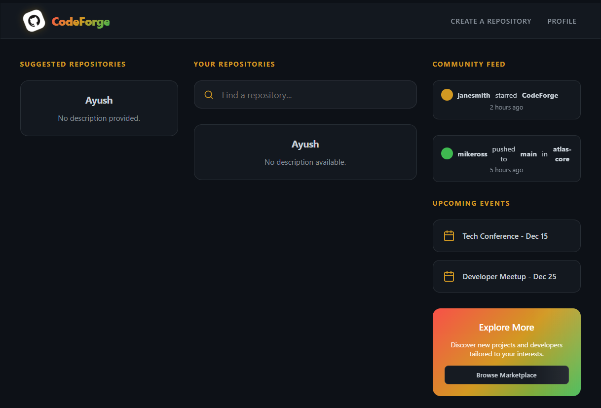
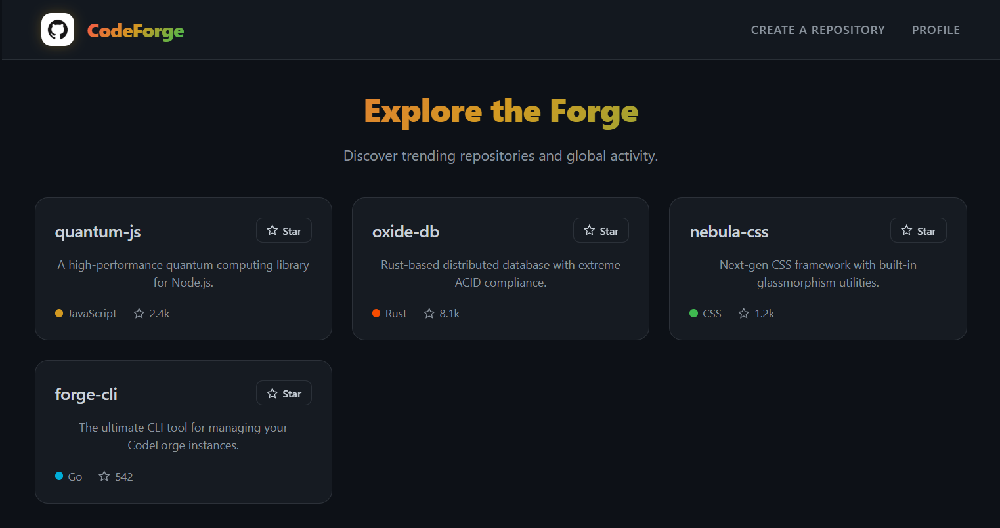
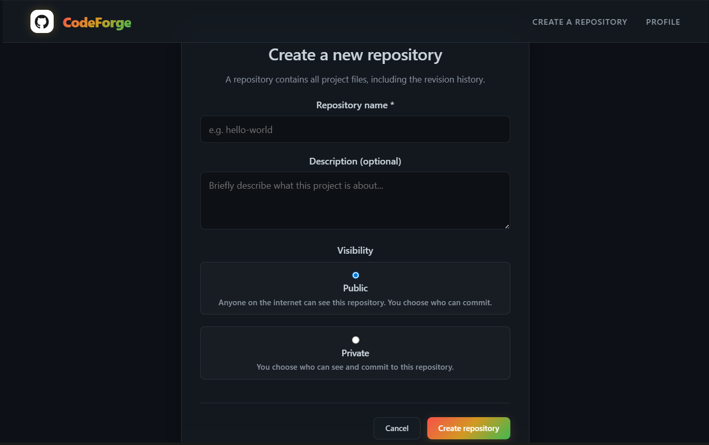
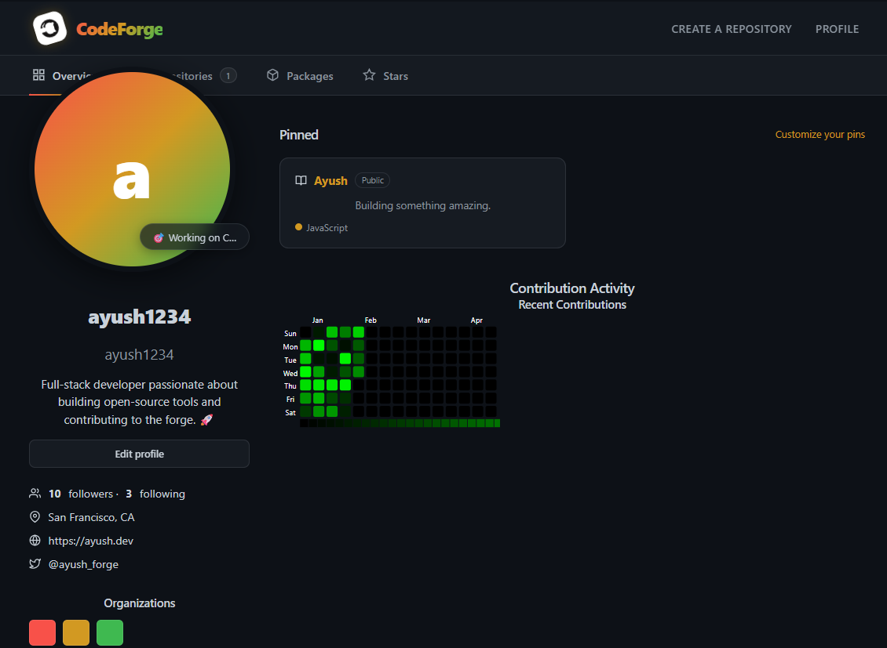
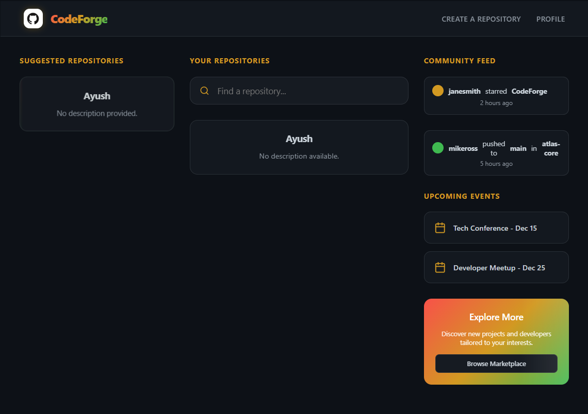

<div align="center">

# ⚒️ CodeForge
**The Premium Git Experience**

[](https://github.com/AYUSHSAINI9876/CodeForge)
<br>


---

### 🚀 Redefining Repository Management
CodeForge is a next-generation, premium Git management platform designed for developers who value aesthetics as much as performance. Featuring a stunning **Red-Yellow-Green** design system, CodeForge provides a seamless experience for managing source code, tracking issues, and visualizing developer activity with production-grade precision.

[Explore Features](#-core-features) • [Installation Guide](#-run-method) • [Showcase](#-project-showcases)

</div>

---

## 📸 Project Showcases

### 🏠 Developer Dashboard
> The central hub for all your development activity. Features a three-column layout with suggested repositories, your active projects, and a global community feed.


### 👤 Professional Profile
> A personalized developer portfolio including a bio, social links, pinned repositories, and a contribution heatmap.


### 📂 Repository Management
> A deep-dive view into your projects with mock Git cloning, language distribution bars, and detailed sidebar statistics.


### 🎫 Issue Tracking
> Collaborate efficiently with integrated issue tracking. Create, view, and manage project roadblocks with ease.


### 🌍 Global Explore Section
> Discover trending projects and community activity at a glance.


---

## 💎 Core Features

- **🎨 Premium Mixture Theme**: Custom-built UI using a vibrant Red-Yellow-Green palette with glassmorphism and smooth micro-animations.
- **📊 Interactive Heatmap**: Visualize contribution history using a dedicated activity grid.
- **📁 Smart Repository Flow**: Automated repository creation with granular visibility controls and descriptive metadata.
- **🛠️ Production Issue Tracker**: Full lifecycle management for issues, including status tracking and historical logs.
- **👤 Elite User Profiles**: Showcase your skills with bios, social integration, and pinned repository highlights.
- **🔍 Activity Feed**: Real-time community updates featuring global pushes, stars, and project trends.

---

## 🛠️ Technology Stack

| Layer | Technologies |
|---|---|
| **Frontend** | React 18, Vite, Axios, React Router, UIW HeatMap |
| **Backend** | Node.js, Express.js, JWT Authentication |
| **Database** | MongoDB (Mongoose ODM) |
| **Design** | Custom CSS Variables, Glassmorphism UI |
| **CI/CD** | Production-ready structure with environment-based configuration |

---

## ⚙️ Environment Configuration

Both apps read config from `.env` files that are **never committed** (see `.gitignore`). Copy the provided examples and fill them in:

```bash
cp backend-main/.env.example backend-main/.env
cp frontend-main/.env.example frontend-main/.env
```

**`backend-main/.env`**
```env
PORT=3002
MONGODB_URI=mongodb://127.0.0.1:27017/codeforge
JWT_SECRET_KEY=change_this_to_a_long_random_value
FRONTEND_URL=http://localhost:5173
```

**`frontend-main/.env`**
```env
VITE_API_URL=http://localhost:3002
```

---

## 📧 SendGrid Setup (Login OTP)

Signing in is protected by **email two-factor verification**: after the password is accepted, CodeForge emails a 6-digit code that must be entered before a session is issued.

> **You can test the whole flow without SendGrid.** If `SENDGRID_API_KEY` is left blank and `NODE_ENV` is not `production`, the code is printed to the backend terminal instead of being emailed, and the UI tells you to look there.

### 1. Create the account and sender
1. Sign up at [sendgrid.com](https://signup.sendgrid.com/) (free tier: 100 emails/day).
2. **Settings → Sender Authentication**. Pick one:
   - *Single Sender Verification* — fastest. Add one address (e.g. your Gmail), then click the link in the confirmation email SendGrid sends you.
   - *Domain Authentication* — required if you want to send from `noreply@yourdomain.com`. Add the DNS records SendGrid shows you.
3. Whatever address you verify here is what goes in `SENDGRID_FROM_EMAIL`. **An unverified sender causes every send to fail with a 403.**

### 2. Create the API key
1. **Settings → API Keys → Create API Key**.
2. Name it (e.g. `codeforge-otp`), choose **Restricted Access**, and enable **Mail Send → Full Access**. Nothing else is needed.
3. Copy the key immediately — SendGrid shows it exactly once. It starts with `SG.`.

### 3. Environment variables

| Variable | Required | Example | Notes |
|---|---|---|---|
| `SENDGRID_API_KEY` | Yes (prod) | `SG.xxxxxxxx...` | Needs only the *Mail Send* permission. Blank in dev → codes print to console. |
| `SENDGRID_FROM_EMAIL` | Yes (prod) | `noreply@yourdomain.com` | **Must be a verified sender** in SendGrid. |
| `SENDGRID_FROM_NAME` | No | `CodeForge` | Display name on the email. Defaults to `CodeForge`. |
| `NODE_ENV` | Yes (prod) | `production` | In production, missing SendGrid config is a hard error rather than a console fallback. |

Add all four to `backend-main/.env` locally, and to your **backend** Vercel project's environment variables for production.

### Security properties of the OTP flow
- Codes are generated with `crypto.randomInt` and stored **bcrypt-hashed** — a database dump yields no usable codes.
- Single use, 10-minute expiry, enforced by a MongoDB TTL index.
- Max 5 wrong attempts per code, then it is locked.
- 45-second cooldown between resends; issuing a new code voids the previous one.
- Step 1 returns only a short-lived *challenge token*, never a session token — a correct password alone cannot log you in.

---

## 🏃 Run Method

Follow these steps to launch the CodeForge environment:

### 1. Repository Setup
```bash
git clone https://github.com/AYUSHSAINI9876/CodeForge.git
cd CodeForge
```

### 2. Backend Initialization
```bash
cd backend-main
npm install
npm start
```

### 3. Frontend Initialization
```bash
cd frontend-main
npm install
npm run dev
```

---

## ☁️ Deploying to Vercel

CodeForge deploys as **two separate Vercel projects** — one for `frontend-main` (a static Vite build) and one for `backend-main` (an Express API running as a Vercel serverless function). This matches the existing folder split, so no repository restructuring is needed.

### 1. Provision a cloud database
Vercel's serverless functions cannot reach `127.0.0.1` — you need a reachable MongoDB. [MongoDB Atlas](https://www.mongodb.com/cloud/atlas/register) has a permanent free tier:
1. Create a free cluster (M0).
2. Database Access → add a database user with a username/password.
3. Network Access → add `0.0.0.0/0` (Vercel's serverless IPs are dynamic, so this is required).
4. Get your connection string from "Connect → Drivers" — it looks like `mongodb+srv://<user>:<password>@<cluster>.mongodb.net/codeforge?retryWrites=true&w=majority`.

### 2. Deploy the backend
1. In Vercel: **Add New → Project**, import this repo, set **Root Directory** to `backend-main`.
2. Framework preset: "Other". Vercel will pick up `vercel.json` and `api/index.js` automatically.
3. Add environment variables: `MONGODB_URI` (from Atlas), `JWT_SECRET_KEY` (generate with `node -e "console.log(require('crypto').randomBytes(48).toString('hex'))"`), `NODE_ENV=production`, `SENDGRID_API_KEY`, `SENDGRID_FROM_EMAIL`, `SENDGRID_FROM_NAME`, and `FRONTEND_URL` (fill in after step 3, then redeploy).
4. Deploy. Note the resulting URL, e.g. `https://codeforge-backend.vercel.app`.

### 3. Deploy the frontend
1. **Add New → Project**, same repo, **Root Directory** set to `frontend-main`.
2. Framework preset: Vite (auto-detected).
3. Add environment variable `VITE_API_URL` = your backend's Vercel URL from step 2.
4. Deploy. Note the resulting URL, e.g. `https://codeforge.vercel.app`.

### 4. Close the loop
Go back to the backend project's environment variables and set `FRONTEND_URL` to the frontend's URL from step 3, then redeploy the backend (Vercel → Deployments → ⋯ → Redeploy). This is what allows CORS to accept requests from your live frontend.

---

## 📁 Project Architecture

```text
CodeForge/
├── backend-main/          # Express API
│   ├── api/index.js       # Vercel serverless entry (exports the Express app)
│   ├── app.js             # Express app: middleware, routes, error handling
│   ├── server.js          # Local dev entry (app.listen)
│   ├── config/db.js       # Cached Mongoose connection
│   ├── controllers/       # Logic handlers (users, repos, issues)
│   ├── middleware/        # authMiddleware (JWT) + authorizeMiddleware (ownership)
│   ├── models/            # Mongoose schemas (incl. otpModel with TTL index)
│   ├── services/          # otpService (generate/verify) + mailer + email template
│   ├── routes/            # Route definitions
│   ├── vercel.json        # Rewrites all paths to api/index.js
│   └── index.js           # CLI entry (start/init/add/commit/push/pull/revert)
├── frontend-main/         # React Application
│   ├── public/codeforge.svg  # Favicon / brand mark
│   ├── src/
│   │   ├── api/client.js  # Shared axios instance (auth header, base URL)
│   │   ├── components/    # Modular UI blocks (common/, auth/, dashboard/, repo/, user/)
│   │   │   ├── common/Logo.jsx   # Single source of truth for the brand mark
│   │   │   └── auth/OtpForm.jsx  # 6-digit code entry (paste, autofill, resend)
│   │   ├── context/       # ToastContext (notifications)
│   │   └── index.css      # Global design tokens
├── docs/
│   └── screenshots/       # Documentation media
└── README.md              # This file
```

---

<div align="center">

Distributed under the MIT License. Developed with ❤️ by **AYUSHSAINI9876**

[**Back to Top**](#️-codeforge)

</div>